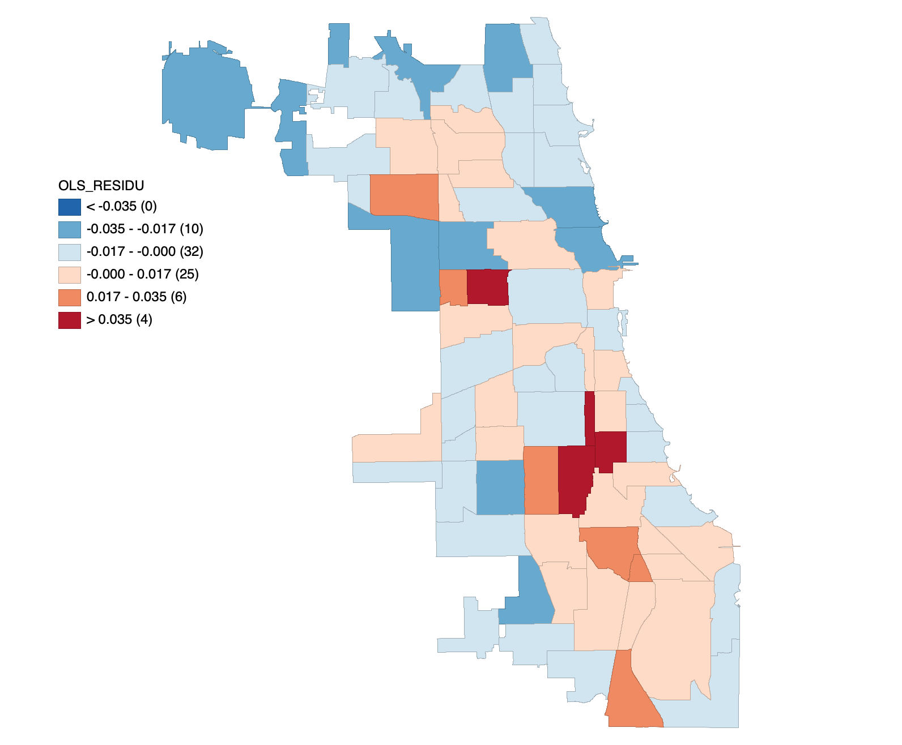

# Lab 4

```{r setup, include=FALSE}
knitr::opts_chunk$set(echo = TRUE)
knitr::opts_knit$set(root.dir = './ChicagoV2')
getwd()
```

Load the necessary package
```{r results='hide', warning=FALSE, message=FALSE}
library(sf)
library(spdep)
library(ggplot2)
library(classInt)
library(broom)
library(lmtest)
library(tseries)
```

Task 1 - Read the data in R
```{r results='hide', warning=FALSE, message=FALSE}
chicago <- st_read(dsn = ./ChicagoV2.shp')
```


Task 2
```{r  warning=FALSE, message=FALSE}
#Breaking VlntCrRt variable into 6 classesd
brks = classIntervals(chicago$VlntCrRt, n=6, style="jenks", intervalClosure = 'left')
chicago$Vcrimerate <- cut(chicago$VlntCrRt, brks$brks)

#plotting the new variable on the map
ggplot()  +
  geom_sf(data = chicago, aes(fill = Vcrimerate)) +
  scale_fill_brewer(palette = "YlOrRd") +
  coord_sf() + theme_dark()
```


Task 3
Scatter plot in Geoda of the violent crime rate against child poverty


Scatter plot in Geoda of the violent crime rate against high school education


Task 4 OLS regression model
```{r}
chicago_lm <- lm(VlntCrRt ~ ChldPov14 + NoHS14, data = chicago)
summary(chicago_lm)
```

Both child poverty and high school education have a significant effect on violent crime rate in OLS regression model. The regression coefficient for child poverty is 1.270e-05, indicating a positive correlation with violent crime rate. Whereas, regression cofficient for high school education is -6.957e-06, indicating a negative correlation with violent crime rate. The model has a significant p value of 2.175e-12. Adjusted R-squared is 0.53 suggesting that there could be other explanatory variables to explain the the variance in violent crime rate.

Task 5 OLS regression diagnostics
```{r}
plot(chicago_lm)
```

The diagnostic plot shows that residuals are likely to not normally distributed and heteroscedastic. This will be confirmed by hypothesis testing below. Also some points seems to be outliers and have high influence on the model.


Hypothesis testing for homoscedasticity
```{r}
bptest(chicago_lm)
```

Breusch-Pagan test results in a p value 0.375, which accept the null hypothesis that the residuals are homoscedastic. 

Hypothesis testing for Normality
```{r}
jarque.bera.test(chicago_lm$residuals)
```


Jarque Bera test results in a p value  2.063e-09, which point to deviation from normality for the residuals. 


Task 6 Map of residuals



Visually, clusters of positive residual exists south of Chicago.

Task 7

Evaluatimg residuals for spatial autocorrelation in R
```{r}
nbs <- poly2nb(chicago, queen = FALSE)
weights <- nb2listw(nbs, style = "B")
lm.morantest(chicago_lm, weights)
```

Testing the assumption of zero autocorrelation under normality
```{r}
moran.test(chicago$VlntCrRt, weights, randomisation = FALSE)
```
There is a significant autocorrelation between violent crime rate and location. 

Testing spatial autocorrelation using Monto Carlo simulation
```{r}
moran.mc(chicago$VlntCrRt, weights, 99)
```
It also shows significant spatial autocorrelation.


Task 8


